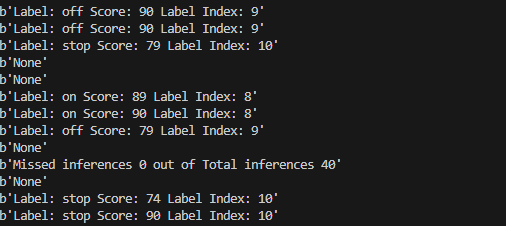

# kws_lights
This is is a Keyword spotting(kws) project based on ARMs [KWS model](https://www.isca-archive.org/interspeech_2021/berg21_interspeech.pdf)  meant to be used for lights control .

The hardware choice for this is Himax's [Wise Eye 2](https://www.himax.com.tw/products/wiseeye-ai-sensing/wiseeye2-ai-processor/).

The code is bit challenging for a beginner please refer to Himax's [SDK](https://himaxwiseeyeplus.github.io/) .

## SAMPLE DEMO

### TO DO 
- [ ] Update the model
- [ ] Update README
- [ ] Add I2C coms
